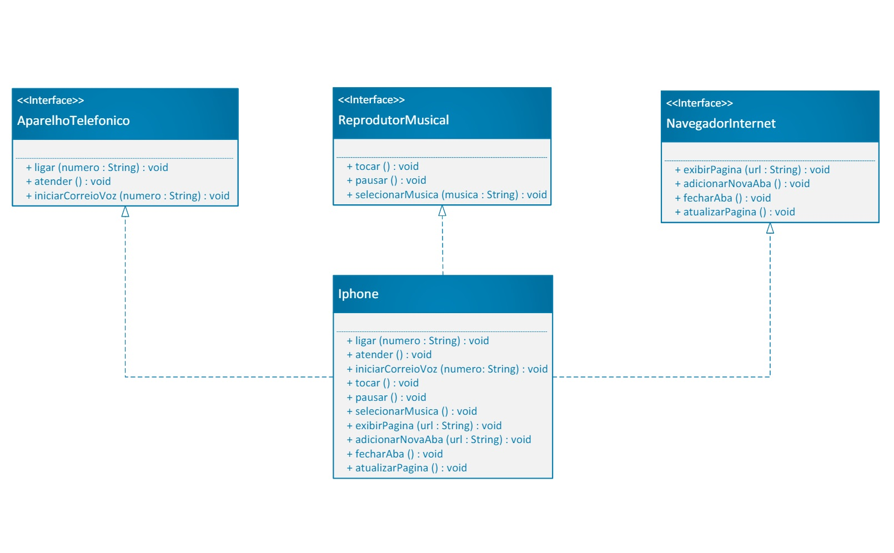

Foi elaborado um repositório que contém uma implementação detalhada de um desafio de modelagem de software focado em replicar as funcionalidades de um iPhone. Utilizando programação orientada a objetos e técnicas de modelagem UML, o projeto visa criar uma estrutura robusta para simular um iPhone atuando como Reprodutor Musical, Aparelho Telefônico e Navegador na Internet. 

O repositório inclui código-fonte em Java para as classes e interfaces correspondentes, além de documentação completa, insights de design e instruções detalhadas para execução do código e exploração do diagrama UML associado. Este projeto proporcionou uma oportunidade de aplicar melhores práticas de engenharia de software, desenvolvendo um profundo entendimento de modelagem e programação orientada a objetos na criação de sistemas complexos e funcionais.

## 📊 Diagrama UML

  

